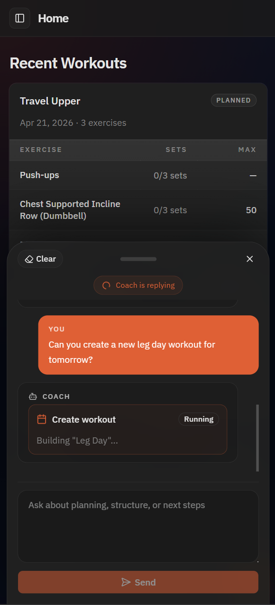
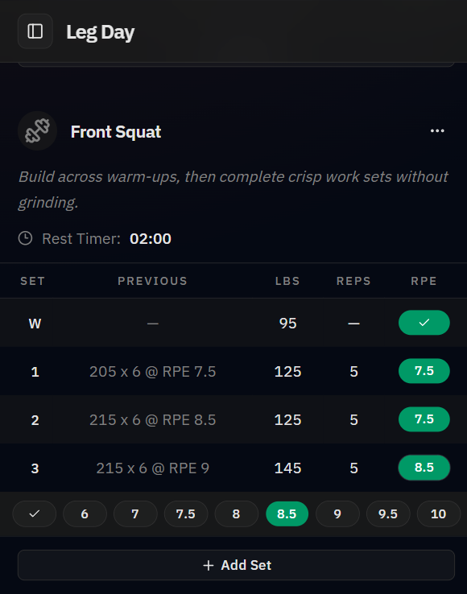
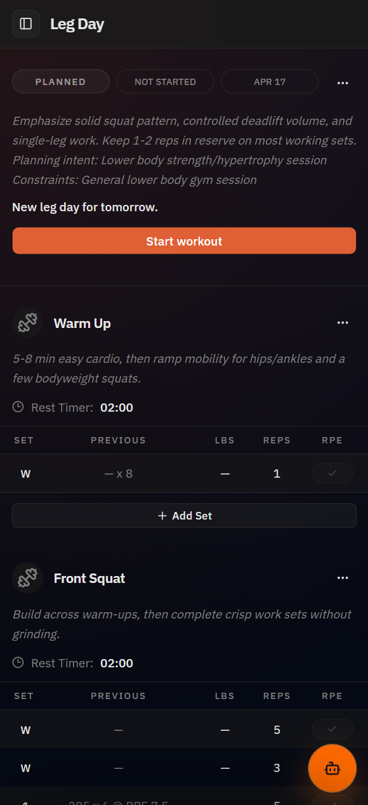
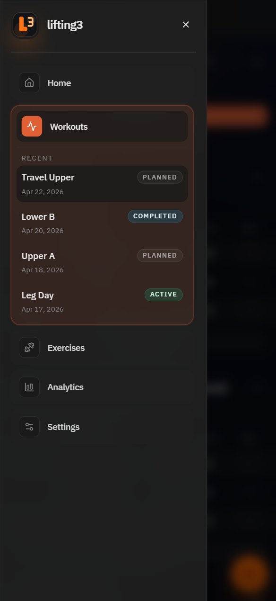

# lifting3

**An AI-native workout app for planning sessions, logging sets fast, and keeping training history useful.**

Ask for tomorrow's leg day, get a real structured workout, then move straight into a focused logging flow with previous-performance context, quick RPE entry, and workout-specific coaching.

`lifting3` is not a chatbot wrapped around fitness prompts. It is a workout product first: planning, session execution, history, and coaching are all tied to the same training system.

## Preview

<table>
  <tr>
    <td width="50%" align="center">
      
    </td>
    <td width="50%" align="center">
      
    </td>
  </tr>
  <tr>
    <td valign="top">
      <strong>Coach-driven planning</strong><br />
      The app can turn a natural-language request into a planned workout instead of dumping back generic advice.
    </td>
    <td valign="top">
      <strong>Fast live logging</strong><br />
      Active sessions keep the important controls on-screen: previous set context, current load and reps, and one-tap RPE selection.
    </td>
  </tr>
  <tr>
    <td width="50%" align="center">
      
    </td>
    <td width="50%" align="center">
      
    </td>
  </tr>
  <tr>
    <td valign="top">
      <strong>Structured workout detail</strong><br />
      Planned sessions already look like something you can train from: notes, constraints, exercise order, set targets, and a clean path into the live workout.
    </td>
    <td valign="top">
      <strong>Built like a product</strong><br />
      Navigation, recent sessions, and route structure are already shaped like a real app, not a one-screen prototype.
    </td>
  </tr>
</table>

## Why This Project Is Interesting

- The coach can create and modify workouts, but the result is always a proper workout model you can browse, edit, and log against.
- The workout screen is optimized for the main loop: start the session, record the set, assign RPE, move on.
- History is first-class. Workouts and exercises are browsable on their own instead of being buried inside chat transcripts.
- The architecture keeps the product honest: chat is useful, but it does not replace structured state.

## What It Does Today

- `Home` surfaces recent workouts and acts as the daily landing page.
- `Workouts` lists planned, active, and completed sessions and links into full workout detail pages.
- `Workout detail` supports notes, set edits, set confirmation, add/remove set actions, carry-forward values, and workout completion.
- `Exercises` provides a filterable exercise catalog with history-aware summary cards.
- `Coach` is available from a floating sheet and can create workouts, patch workouts, query history, and save durable profile context.
- `Analytics` and `Settings` are present in the app shell but still intentionally marked coming soon.

## Product Shape

The current build is strongest in four areas:

- **Plan a workout** with the embedded coach or from structured data.
- **Run the workout** with a UI built around quick set logging.
- **Browse history** through workouts and exercises, not just messages.
- **Keep coaching attached** to the workout flow instead of splitting it into a separate tool.

This repo is intentionally single-user for now and assumes perimeter access through Cloudflare Access rather than an in-app auth flow.

## Stack

- React 19
- React Router 7
- Cloudflare Workers
- Cloudflare D1 + Drizzle
- Cloudflare Agents
- Tailwind CSS v4
- shadcn/ui
- Vite+

## Local Development

1. Copy `.env.sample` to `.env`.
2. Set `OPENAI_API_KEY` if you want the coach flow available through Cloudflare AI Gateway's OpenAI provider.
3. Run `pnpm install`.
4. Apply local migrations with `pnpm db:migrate:local`.
5. Seed sample workouts with `pnpm db:seed:local`.
6. Start the app with `pnpm dev`.

The default local URL is `http://localhost:43110`.

```

## Reference Docs

- [docs/spec.md](docs/spec.md) - product and architecture spec
- [docs/cloudflare-agents.md](docs/cloudflare-agents.md) - Cloudflare architecture guidance for D1, Drizzle, and Agents
```
